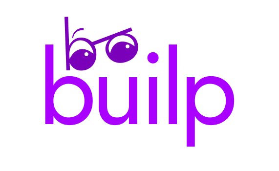

# builp

Learn by building. Write, generate, and work through courses consisting of written lessons, runnable code practice, and interactive activities.

Live at [builp.kdnth.co](https://builp.kdnth.co).

## Stack

- **Frontend**: React, TypeScript, Vite, Mantine
- **Backend**: FastAPI, SQLAlchemy, Alembic, Postgres
- **Auth**: Neon Auth
- **Course generation**: LangGraph, provider-tiered LLM routing (Anthropic, OpenAI, Groq, xAI, Mistral, Gemini, Ollama, DeepSeek)

## Project layout

```
frontend/   React app
backend/    FastAPI app, database, course generation
docs/       Design notes and plans
```

## Setup

You need:

- Node 20 or later
- Python 3.12 or later, and [uv](https://docs.astral.sh/uv/)
- A [Neon](https://neon.tech) project, with Neon Auth turned on
- An [Anthropic API key](https://console.anthropic.com), for the server-managed free generation credit path

### Backend

```bash
cd backend
cp .env.example .env
# fill in DATABASE_URL, NEON_AUTH_URL, ANTHROPIC_API_KEY
uv sync
uv run alembic upgrade head
uv run uvicorn app.main:app --reload --port 8000
```

Details on the API, tests, and migrations: [backend/README.md](backend/README.md).

### Frontend

```bash
cd frontend
cp .env.example .env.local
# fill in VITE_NEON_AUTH_URL
npm install
npm run dev
```

Open http://localhost:5173.

### Auth configuration (Neon)

These auth flows depend on Neon Auth settings in your Neon project:

- Turn on **Sign-up with Email**.
- Turn on **Verify at Sign-up** (recommended for production).
- For verification links, configure a custom email provider. With Neon's shared
  provider, use verification codes.
- Add your app origins to trusted domains (for example `http://localhost:5173`
  and your production domain) so auth redirects are accepted.

Password reset is available when email authentication is enabled.

### Generation modes

Users can choose one of two generation paths when creating a course:

- **Free credit**: one generation per rolling 24-hour window, using the server-managed Anthropic key.
- **Provider API key**: bypasses the daily free-credit limit by supplying an `anthropic`, `openai`, `groq`, `xai`, `mistral`, `gemini`, `ollama`, or `deepseek` API key. The key is used in-memory for that generation request only and is not written to the database or logs.

Default model tier maps and provider endpoint overrides are documented in
`backend/README.md`.

## Roadmap

- Code practice support for more languages, not just JavaScript
- Code practice IDE improvements: type hints, tab indenting, custom test cases
- More interactive activity types

## Contributing

See [CONTRIBUTING.md](CONTRIBUTING.md).

## License

MIT. See [LICENSE](LICENSE).
